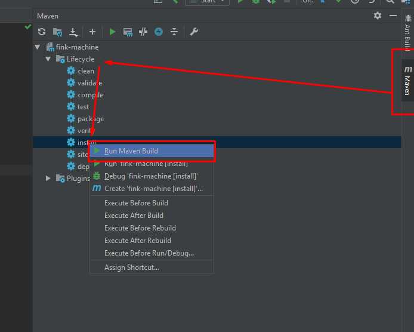

##If you are in capstone and are working on this project, email me from your IUS email at "justinbutler4@hotmail.com" with github usernames or emails so I can add you as a collaborator to the repository. Also feel free to email me if you have any issues or questions regarding the project. Read the first page of the UserManual for more information. 

### Requirements
* [Java 8+ jdk](https://www.oracle.com/technetwork/java/javaee/downloads/jdk8-downloads-2133151.html)
* [Python 3](https://www.python.org/download/releases/3.0/)
* [IntelliJ](https://www.jetbrains.com/idea/) - This project was built while using IntelliJ so all installation and project setup assumes you are also using it. You may have a bad time if you don't.
* [Java FX Scene Builder](https://www.oracle.com/technetwork/java/javase/downloads/javafxscenebuilder-info-2157684.html)
* (Optional) [Chocolatey (windows only)](https://chocolatey.org/)

### Installation
This project currently uses maven as it's build tools. There is currently no packages being used by it but it will be very beneficial once packages are needed. Maven is bundled with Intelli so if you are using it you can skip step 3.

1. Make sure all the requirements are installed.
2. Clone the repository `https://github.com/jb1361/fink-machine.git`
3. (Optional) Install maven `choco install maven -y` If you are not on windows, you can follow mavens setup instructions from [here](http://maven.apache.org/index.html).

If not using IntelliJ more setup may require more setup.

### Building

To Build the executable jar file either run the maven build or in your terminal run `mvn package`

### Running 

To run the jar file by passing in a file you run `java -jar jarname.jar fsmname.fsm outputfilename.py` or you can double click the executable jar file.
The jar file will be located under the "target" directory.

There is a sample fsm file in the fsm-files directory.
Currently only python is supported as an output file-type so make sure to pass in a .py file as the second argument.